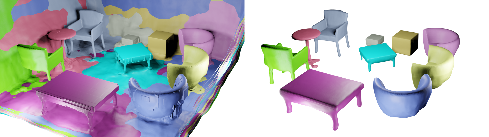

<p align="center">

  <h1 align="center"> :couch_and_lamp: RICO: Regularizing the Unobservable for Indoor Compositional Reconstruction (ICCV2023)</h1>
  <p align="center">
    <a href="https://kyleleey.github.io/">Zizhang Li</a>,
    <a href="https://shawlyu.github.io/">Xiaoyang Lyu</a>,
    <a>Yuanyuan Ding</a>,
    <a href="https://sallymmx.github.io/">Mengmeng Wang</a>,
    <a href="https://yiyiliao.github.io/">Yiyi Liao</a>,
    <a href="https://person.zju.edu.cn/yongliu">Yong Liu</a>

  </p>
  <h2 align="center">ICCV2023</h2>
  <h3 align="center"><a href="https://arxiv.org/abs/2303.08605">Paper</a></h3>
  <div align="center"></div>
</p>

<p align="center">
  <a href="">
    
  </a>
</p>

<p>
We use geometry motivated prior information to regularize the unobservable regions for indoor compositional reconstruction. 
</p>
<br>

## TODO
- [x] Training code
- [x] Evaluation scripts
- [x] Mesh extraction script
- [x] Editted rendering script
- [ ] Dataset clean

## Setup

### Installation
Clone the repository and create an anaconda environment called rico using
```
git clone git@github.com:kyleleey/RICO.git
cd RICO

conda create -y -n rico python=3.8
conda activate rico

conda install pytorch torchvision cudatoolkit=11.3 -c pytorch

pip install -r requirements.txt
```

### Dataset
We provide processed scannet and synthetic scenes in this [link](). Please download the data and unzip in the `data` folder, the resulting folder structure should be:
```
└── RICO
  └── data
    ├── scannet
    ├── syn_data
```
## Training

Run the following command to train rico on the synthetic scene 1:
```
cd ./code
bash slurm_run.sh PARTITION CFG_PATH SCAN_ID PORT
```
where `PARTITION` is the slurm partition name you're using. You can use `confs/RICO_scannet.conf` or `confs/RICO_synthetic.conf` for `CFG_PATH` to train on ScanNet or synthetic scene. You also need to provide specific `SCAN_ID` and `PORT`.

If you are not in a slurm environment you can simply run:
```
python training/exp_runner.py --conf CFG_PATH --scan_id SCAN_ID --port PORT
```

## Evaluations

To run quantitative evaluation on synthetic scenes for object and masked background depth:
```
cd synthetic_eval
python evaluate.py
python evaluate_bgdepth.py
```
Evaluation results will be saved in `synthetic_eval/evaluation` as .json files.

We also provide other scripts for experiment files after training.

To extract the per-object mesh and the combined scene mesh:
```
cd scripts
python extract_mesh_rico.py
```

To render translation edited results:
```
cd scripts
python edit_render.py
```

You can change the detailed settings in these scripts to run on top of different experiment results.

## Acknowledgements
This project is built upon [MonoSDF](https://github.com/autonomousvision/monosdf), [ObjSDF](https://github.com/QianyiWu/objsdf) and also the original [VolSDF](https://github.com/lioryariv/volsdf). To construct the synthetic scenes, we mainly use the function of [BlenderNeRF](https://github.com/maximeraafat/BlenderNeRF). We thank all the authors for their great work and repos. 


## Citation
If you find our code or paper useful, please cite
```bibtex
@inproceedings{li2023rico,
  author    = {Li, Zizhang and Lyu, Xiaoyang and Ding, Yuanyuan and Wang, Mengmeng and Liao, Yiyi and Liu, Yong},
  title     = {RICO: Regularizing the Unobservable for Indoor Compositional Reconstruction}, 
  booktitle = {ICCV},
  year      = {2023},
}
```
